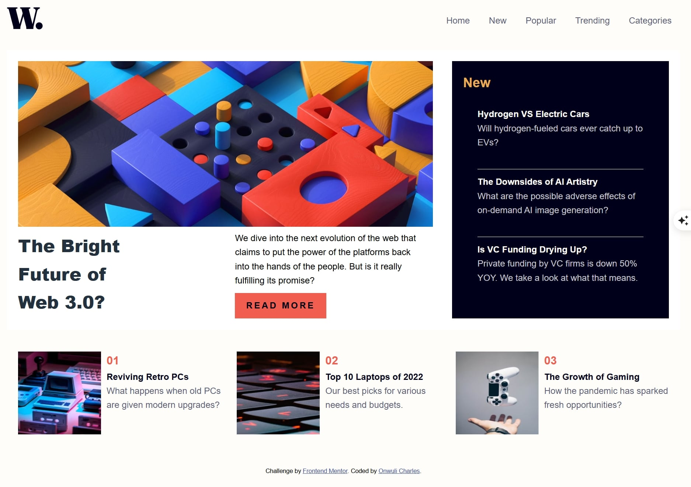

# Frontend Mentor - News homepage solution

This is a solution to the [News homepage challenge on Frontend Mentor](https://www.frontendmentor.io/challenges/news-homepage-H6SWTa1MFl). Frontend Mentor challenges help you improve your coding skills by building realistic projects. 

## Table of contents

- [Overview](#overview)
  - [The challenge](#the-challenge)
  - [Screenshot](#screenshot)
  - [Links](#links)
- [My process](#my-process)
  - [Built with](#built-with)
  - [What I learned](#what-i-learned)
  - [Continued development](#continued-development)
  - [Useful resources](#useful-resources)
- [Author](#author)
- [Acknowledgments](#acknowledgments)

## Overview

### The challenge

Users should be able to:

- View the optimal layout for the interface depending on their device's screen size
- See hover and focus states for all interactive elements on the page

### Screenshot

### Links

- Solution URL: https://github.com/Ot-Charlie/news-homepage
- Live Site URL: https://ot-charlie.github.io/news-homepage/

## My process

### Built with

- Semantic HTML5 markup
- CSS custom properties
- CSS Grid
- Desktop-first workflow

### What I learned
This project was really impactful in making me understand the workings of grid. I had become very dependent on flex, but this project made me see the technicality and advantages of grid in the right situation. I also learnt how to deal with in-line elements as they do not follow the regular rules of block. I learnt how to make a functional popup menu.

### Continued development
I want to continue developing my javascript skills as well as knowing how to debug properly. I also want to improve on the time it takes me to turn out projects.

### Useful resources

Claude AI was very useful in providing refreshers for areas which were grey to me.

## Author

- Website - https://onwuli-charles.netlify.app
- Frontend Mentor - https://www.frontendmentor.io/profile/ot.charlie
- Twitter - https://www.twitter.com/kingcharlie01

